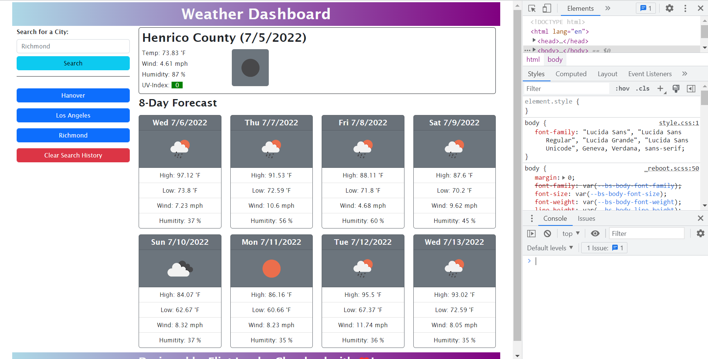

# My-Weather-Dashboard
A web app that makes API calls to OpenWeather and presents current weather info, a forecast and stores search history

## Link
https://eclevela-1234.github.io/my-weather-dashboard/

## Topics Covered
* API calls, asynchronous functions
* Error handling
* Conditionals loops
* Separation of tasks

## Bonus
* Incorporated geolocation and reverse geocoding to give weather for current location
* Added a "clear search history button"
* Displayed high/low temps instead of just average, 8 day forcast instead of 5

## Final Thoughts
Working with asychronous functions created unexpected results at times. There were some errors thrown for seemingly no reason, and things that worked that shouldn't have.  I tried to separate tasks so that fetches occured in isolation. No matter what, it seems like errors will happen with APIs by nature but OpenWeatherMap seems to be pretty forgiving.

